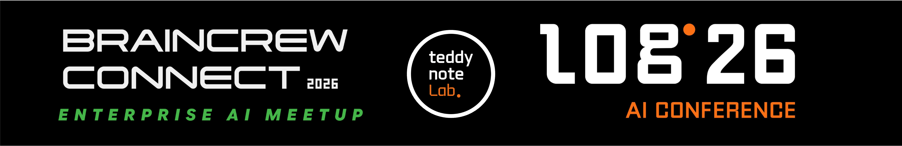

    

### 안녕하세요? 👋

지난 26년 1월 14, 16일 저희 Braincrew의 행사에 참석해주신 모든 분께 감사의 말씀을 먼저 전해드립니다. 처음 진행하는 행사이기에 부족한 점도 있었고 도움이 되는 점도 있었으리라 생각됩니다. 그럼에도 불구하고 많은 분들께서 좋은 반응을 보여주셨고 이에 조금이라도 화답하고자 행사때 발표한 자료를 정리하여 공유드리려고 합니다. 😊 

| Date | Category | Speaker | Title | Link |
| ---- | -------- | ------ | ----- | ---- |
|26.01.14.|Connect2026|Teddy| Opening: 스타트업에서 글로벌 파트너가 되기까지 | [Link](./01.%20Connect2026/01_Connect2026_Teddy.pdf) |
|26.01.14.|Connect2026|Wook| 2026 AI 교육 방향성: 에이전트 빌더 교육으로 AI 역량 키우기 | [Link](./01.%20Connect2026/02_Connect2026_Wook.pdf) |
|26.01.14.|Connect2026|Peter| AX를 위한 Document Parsing: Document Parsing을 더 잘하는 방법 | [Link](./01.%20Connect2026/03_Connect2026_Peter.pdf) |
|26.01.14.|Connect2026|Jaehun| RAG: 제조/금융 사례 공유 - 모두가 MCP/Agent 할 때 BrainCrew는 핵심을 본다 | [Link](./01.%20Connect2026/04_Connect2026_Jaehun.pdf) |
|26.01.14.|Connect2026|Hantaek| Agent 유스케이스: ESG 평가, 사람을 흉내내는 Agent로 다시 설계하다 | [Link](./01.%20Connect2026/05_Connect2026_Hantaek.pdf) |
|26.01.14.|Connect2026|Teddy| Connect Your Knowledge: 지식 기반 구축이 시급한 이유 | [Link](./01.%20Connect2026/06_Connect2026_Teddy.pdf) |
|26.01.16.|Log26|Teddy| Opening: 2025년 기술 여정과 Log26의 의미 | [Link](./02.%20Log26/01_log26_Teddy.pdf) |
|26.01.16.|Log26|Peter| Data Parsing: Document Structuring | [Link](./02.%20Log26/02_log26_Peter.pdf) |
|26.01.16.|Log26|Stella| Intentrix: LLM 서비스 개발 과정에서 마주하는 모호함을 다루는 방법 |  |
|26.01.16.|Log26|Jaehun| RAG 성능 고도화: 제조, 금융, Lifelog 분야 | [Link](./02.%20Log26/04_log26_Jaehun.pdf) |
|26.01.16.|Log26|Sung| Long-term Memory MCP: 사내 솔루션 기반의 개인화된 장기 기억 메모리 MCP 개발 사례 | [Link](./02.%20Log26/05_log26_Sung.pdf) |
|26.01.16.|Log26|Mason| 연구자 특화 Deep Research MCP | [Link](./02.%20Log26/06_log26_Mason.pdf) |
|26.01.16.|Log26|Pangpang| ESG: 터지지 않게 만드는 AI 서비스 엔지니어링 생존 전략 | [Link](./02.%20Log26/07_log26_PangPang.pdf) |
|26.01.16.|Log26|Hantaek| Deep Agents: AI Agent 업그레이드 레시피 | [Link](./02.%20Log26/08_log26_Hantaek.pdf) |
|26.01.16.|Log26|Ben & Ella| AI 프로덕트 엔지니어의 실제 역할: AI 모델이 아니라, AI 제품을 만든다는 것 | [Link](./02.%20Log26/09_log26_Ben_Ella.pdf) |
|26.01.16.|Log26|Hank| 평가(Evaluation): RAG 성능, 무엇을 어떻게 평가해야 하는가? | [Link](./02.%20Log26/10_log26_Hank.pdf) |

### Deep Agent Builder

### Press
- [HSAD, AI 컨퍼런스서 자연어 기반 '딥 에이전트 빌더' 선공개](https://www.news1.kr/industry/general-industry/6039593)
- [HSAD, '딥 에이전트 빌더' 공개…"말만 하면 에이전트 생성"](https://www.etnews.com/20260115000074)
- [원하는 AI 에이전트 말하면 뚝딱… HSAD, 자연어 기반 '딥 에이전트 빌더' 선공개](https://www.brandbrief.co.kr/news/articleView.html?idxno=9451)
- [HSAD, AI 컨퍼런스서 자연어 기반 '딥 에이전트 빌더' 첫 공개](https://www.hsad.co.kr/kor/about/news/info/PST_202601151118280317)
- [HSAD, 국내 최초 자연어 기반 'AI 에이전트 빌더' 공개](https://biz.heraldcorp.com/article/10655863)
- [HS애드, 자연어 기반 '딥 에이전트 빌더' 첫 공개](https://biz.chosun.com/industry/business-venture/2026/01/15/2FYMWEYDJRE2RAXSIUZVAE3CZA/)
- [HSAD, 자연어 기반 '딥 에이전트 빌더' 선공개…2월 출시](https://m.sedaily.com/NewsViewAmp/2K7B9YW2QE)
- [HSAD, '대화만으로 맞춤형 AI 에이전트 구축' 설루션 출시](https://www.yna.co.kr/amp/view/AKR20260115028500003)
- [HSAD "대화가 곧 코딩"…국내 최초 '자연어 기반 AI 빌더' 출시](https://news.nate.com/view/20260115n29691?mid=n1101)
- [HSAD, AI 컨퍼런스서 자연어 기반 '딥 에이전트 빌더' 첫 공개](https://v.daum.net/v/20260115110315693?f=p)

### License & Terms of Use

본 자료는 2026년 1월 14일(Connect2026), 16일(Log26)에 개최된 **Braincrew** 컨퍼런스에서 발표된 자료입니다.

**제3자 재배포 금지**: 본 저장소의 모든 발표 자료(PDF 파일 포함)는 저작권법에 의해 보호됩니다. 발표자 및 Braincrew의 사전 서면 동의 없이 제3자에게 재배포, 복제, 또는 상업적 목적으로 사용하는 것을 금지합니다.

© 2026 Braincrew. All rights reserved.
